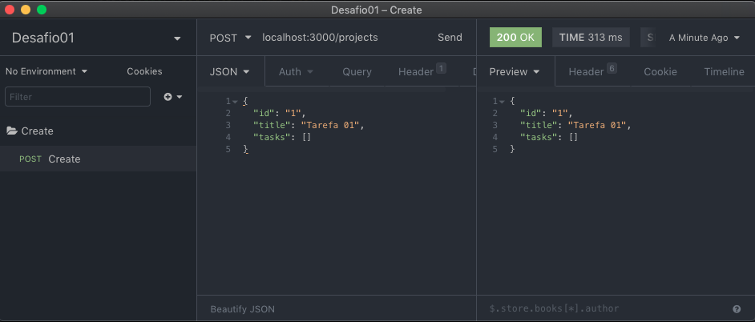
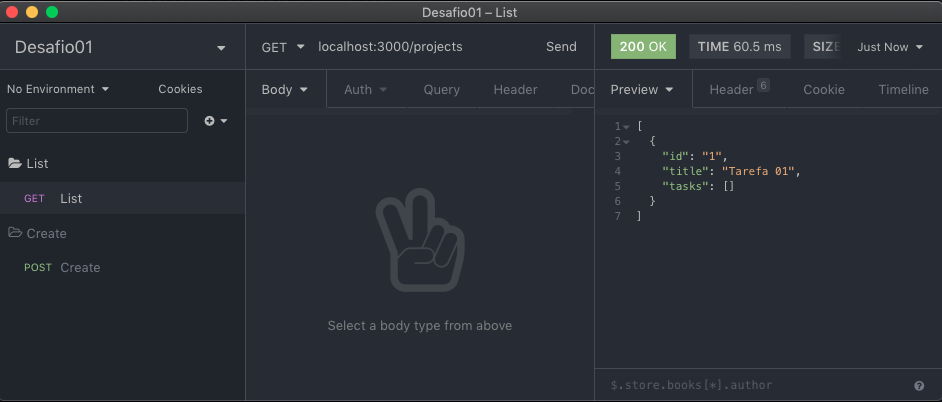
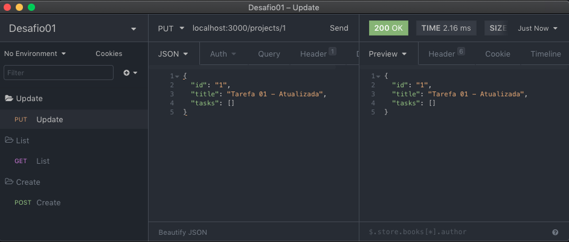
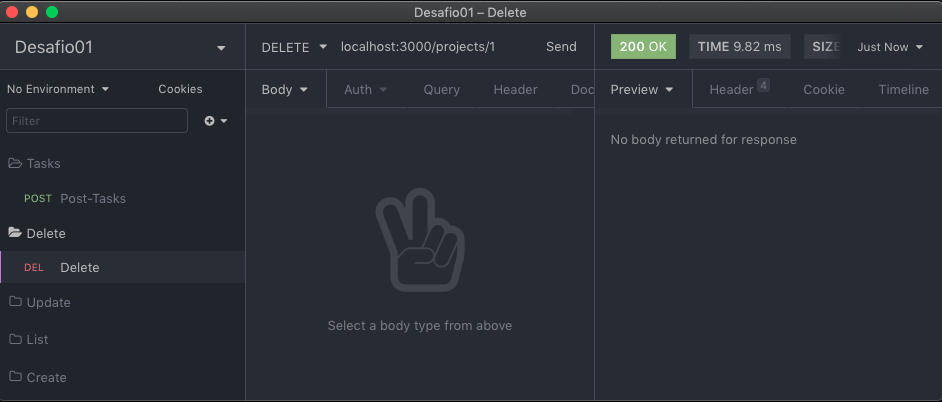
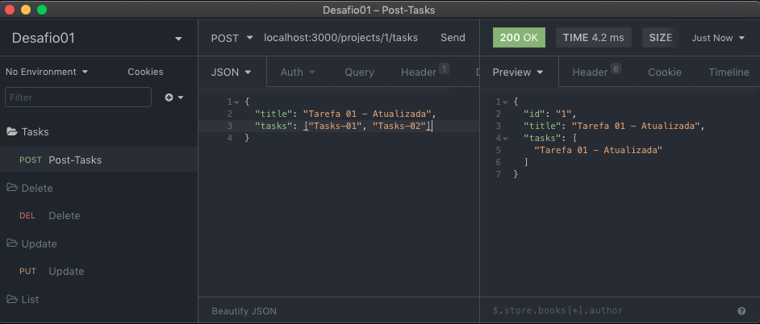
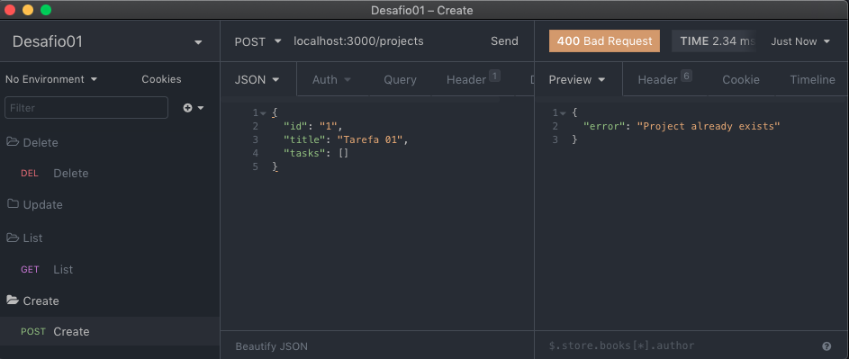
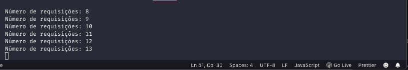

# Desafio 01. Conceitos do NodeJS

Criada uma aplicação em express, para armazenar projetos e suas tarefas.

## Rotas

- [x] - `POST /projects`: A rota deve receber `id` e `title` dentro corpo de cadastrar um novo projeto dentro de um array no seguinte formato: `{ id: "1", title: 'Novo projeto', tasks: [] }`; Certifique-se de enviar tanto o ID quanto o título do projeto no formato string com àspas duplas.



- [x] - `GET /projects`: Rota que lista todos projetos e suas tarefas;


- [x] - `PUT /projects/:id`: A rota deve alterar apenas o título do projeto com o `id` presente nos parâmetros da rota;


- [x] - `DELETE /projects/:id`: A rota deve deletar o projeto com o `id` presente nos parâmetros da rota;


- [x] - `POST /projects/:id/tasks`: A rota deve receber um campo `title` e armazenar uma nova tarefa no array de tarefas de um projeto específico escolhido através do `id` presente nos parâmetros da rota;



## Middlewares

- [x] - Crie um middleware que será utilizado em todas rotas que recebem o ID do projeto nos parâmetros da URL que verifica se o projeto com aquele ID existe. Se não existir retorne um erro, caso contrário permita a requisição continuar normalmente;


- [x] - Crie um middleware global chamado em todas requisições que imprime (`console.log`) uma contagem de quantas requisições foram feitas na aplicação até então;


“Sua única limitação é você mesmo”!

## Para usar

```sh
yarn
```
```sh
yarn dev
```
URL
```sh
http://localhost:3000/
```